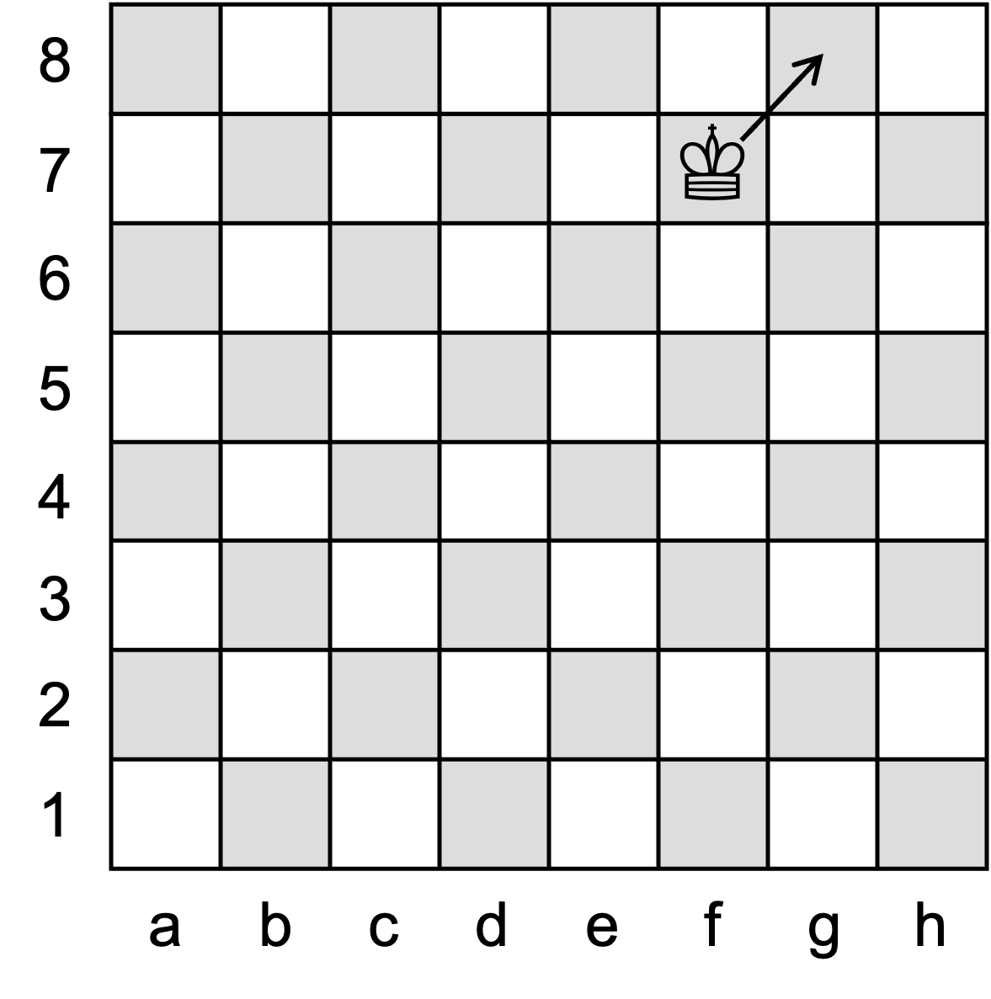
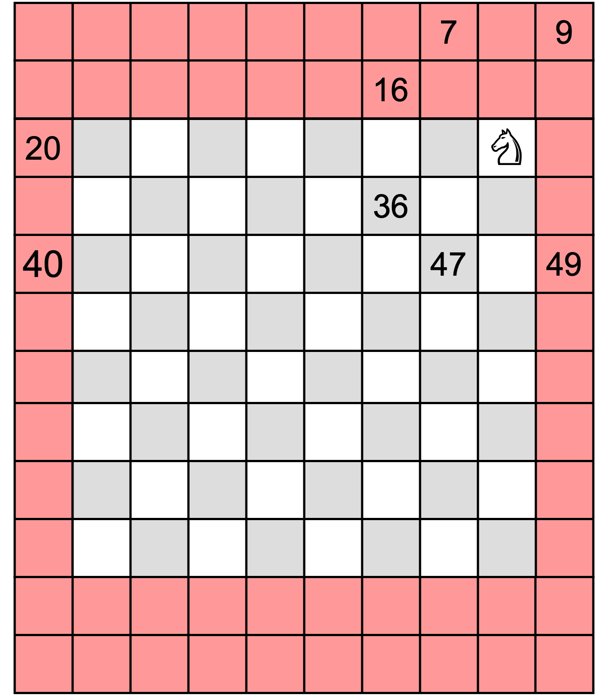

# Kodierung und Repräsentation

## Definition

Man muss beim Begriff der Kodierung acht geben, da insbesondere die Nachrichtentechnik den Begriff geprägt hat, der u.a. durch die Kodierungstheorie fundiert ist. Bei der Programmierung geht es aber nicht um Kanal-, Quellen- oder Leitungskodierung, sondern neben der [Zeichenkodierung](https://de.wikipedia.org/wiki/Zeichenkodierung) und neben den [Daten-](https://de.wikipedia.org/wiki/Datenformat) und [Dateiformaten](https://de.wikipedia.org/wiki/Dateiformat) im Wesentlichen um die Abbildung von Sachverhalten in Daten, Datenstrukturen und Datenverarbeitungsverfahren. Darauf zielen die folgenden Definitionen ab: 

Repräsentation
: Eine Repräsentation stellt eine Konfiguration (Zusammenstellung) von  [Entitäten](https://de.wikipedia.org/wiki/Entit%C3%A4t) samt ihrer Beziehungen textuell, graphisch, bildlich oder in einer anderen medialen Form dar. Diese Darstellungen bilden ideelle (abstrakte), realweltliche (konkrete) oder rechnerisch-computationale (virtuelle) Konstruktionen ab. Die Darstellung kann die Absicht verfolgen, etwas Grundlegendes, Entscheidendes oder Bedeutsames durch die Art und Weise der Darstellung hervorzuheben oder ins Blickfeld zu stellen.

Kodierung
: Eine Kodierung beschreibt die Abbildung einer Repräsentation in eine andere Repräsentation. In der Programmierung geht es wesentlich darum, Kodierungen für Datenrepräsentationen und Berechnungen zu finden bzw. zu verwenden, die computational vorteilhaft und/oder programmiersprachlich oder paradigmatisch geeignet und angemessen sind. Eine wichtige Rolle spielt zudem, diese Kodierungen kommunikabel (mitteilbar) und verständlich zu machen. 

<!--
[Zeichenkodierungen](https://de.wikipedia.org/wiki/Zeichenkodierung) wie [ASCII](https://de.wikipedia.org/wiki/American_Standard_Code_for_Information_Interchange) oder [UTF-8](https://de.wikipedia.org/wiki/UTF-8) und [Daten-](https://de.wikipedia.org/wiki/Datenformat) und [Dateiformate](https://de.wikipedia.org/wiki/Dateiformat) wie [JPEG](https://de.wikipedia.org/wiki/JPEG) für Bilddaten, [MP3](https://de.wikipedia.org/wiki/MP3) für Hördaten oder [JSON](https://de.wikipedia.org/wiki/JavaScript_Object_Notation) für den Datenaustausch sind Beispiele für technische Standards, die Kodierungen von Zeichen, Medien und Daten definieren. Dass z.B. bei JPEG und MP3 verlustbehaftete Datenkompressionen eine Rolle spielen, interessiert Programmiererinnen und Programmierer nur begrenzt.
-->

### Beispiel: Primitive Zahlentypen

Sie kennen diese verschiedenen Repräsentationen bereits für primitive Typen. Zahlen vom Typ `byte`, `short`, `int` und `long` werden _intern_ im Zweierkomplement _kodiert_. Das Zweierkomplement bildet eine vorzeichenbehaftete Zahl in eine Binärzahl fester Stellenanzahl (8 Bits bei `byte`, 16 bei `short`, 32 bei `int` und 64 bei `long`) ab. Die Kodierung ist so beschaffen, dass man im Zweierkomplement mit einer gewöhnlichen Binäraddition negative und positive Zahlen addieren kann und es keiner expliziten Operation der Subtraktion bedarf. _Repräsentiert_ werden Ganzzahlen jedoch im Zehnerformat mit einem Vorzeichen bei negativen Zahlen.

Bei Gleitkommazahlen wie `float` und `double` ist die Kodierung und der Bezug zwischen der binären und dezimalen Zahlenrepräsentation komplizierter. Der technische Standard [IEEE 754](https://de.wikipedia.org/wiki/IEEE_754) definiert die Darstellung von Binär- und Dezimalzahlen für Gleitkommazahlen und für die Durchführungen von Berechnungen.

Datenwerte vom Typ `char` folgen der Zeichenkodierung UTF-8. [UTF-8](https://de.wikipedia.org/wiki/UTF-8) legt fest, welches Zeichen bzw. Symbol wie durch welche binäre Zahlenkodierung abgebildet wird.

<!--
```java
jshell> 345 // Außendarstellung
$59 ==> 345

jshell> String.format("%32s", Integer.toBinaryString(345)).replace(' ', '0') // Kodierung
$60 ==> "00000000000000000000000101011001"

jshell> -345
$61 ==> -345

jshell> String.format("%32s", Integer.toBinaryString(-345)).replace(' ', '0')
$62 ==> "11111111111111111111111010100111"
```

Es wäre nicht besonders geschickt, sich von der Darstellung leiten zu lassen und Zahlen intern als Ziffernfolgen von 0 bis 9, also als `char`s zu kodieren. Darunter würde die Recheneffizienz erheblich leiden.
-->

<!--
#### Alles ist Kodierung, alles Repräsentation

Bei den Begriffen der Kodierung und der Repräsentation muss man sorgfältig trennen, was man da genau bezeichnet: Schaut man sich die eine Seite einer Medaille nur mit verschieden "Brillen" an, oder betrachtet man die zwei Seiten einer Medaille?

*Verschiedene Brillen einer Seite*: Ein Rechner kodiert letztlich alles als Einsen und Nullen. Diese Kodierung kann man somit im Binärformat betrachten. Das Hexadezimalsystem und das Oktalsystem sind zwei weitere verbreitete Notationen bzw. Repräsentationen für Binärkodierungen. Das liegt daran, dass das Oktalsystem mit einer Oktalziffer exakt drei Binärstellen erfassst, das Hexadezimalsystem hingegen exakt vier Binärstellen. Mit diesen Zahlensystemen kann man sehr kompakt Binärziffern darstellen bzw. notieren.

Das, was man unter eine Kodierung versteht, ist die Zuordnung einer Interpretation 
-->

<!-- 
https://en.wikipedia.org/wiki/Multiple_representations_(mathematics_education)
-->

### Beispiel: Kodierung eines Schachfelds

Bei der Programmierung von Brettspielen tritt deutlich zu Tage, hier am Beispiel des Schachspiels, welche unterschiedlichen Bedarfe und Zwecke verschiedene Repräsentationen erfüllen.

In @fig-schachbrett ist, streng genommen, kein Schachbrett, sondern ein schematisches Abbild eines Schachbretts zu sehen. Es befindet sich einzig der weiße König auf dem Spielbrett; der König wird durch ein Symbol repräsentiert. Die Spalten werden im Schach durch Buchstaben, die Reihen durch Zahlen kodiert. Damit kann das Spielfeld einer Spielfigur eindeutig angegeben werden. 

::: {#fig-schachbrett-kodierung2D layout-ncol=2}

{#fig-schachbrett width=80%}

![Schachfeld-Kodierung übernimmt die Zweidimensionalität der Darstellung. Der König befindet sich auf dem Feld mit dem Index [5][6].](KodierungUndRepräsentation/Schachbrett2D.png){#fig-schachbrett2D width=80%}

Ein Schachbrett und seine zweidimensionale Kodierung. Die Indizes laufen für jede Dimension von 0 bis 7.
:::

#### Zweidimensionale Kodierung

Es ist naheliegend, die Zweidimensionalität der Darstellung als Kodierungsidee für die Programmierung aufzugreifen und das Spielfeld durch ein zweidimensionales Array etwa namens `board` abzubilden, siehe @fig-schachbrett2D.

Wollte man den Spielzug des Königs von f7 nach g8 berechnen, so müsste man zunächst überprüfen, ob der König damit nicht über den Rand hinausläuft. Situationen, in denen der König am Spielfeldrand steht, müssen als solche erkannt werden. Zudem muss sichergestellt sein, dass das Zielfeld nicht durch eine Figur der eigenen Farbe belegt ist. Der Programmcode dazu sähe etwa folgendermaßen aus:

```java
final int MOVE_UP_RIGHT_X = +1;
final int MOVE_UP_RIGHT_Y = +1;
toPosX = fromPosX + MOVE_UP_RIGHT_X
toPosY = fromPosY + MOVE_UP_RIGHT_Y
if ((toPosX >= 0 && toPosY <= 7) &&
    (toPosY >= 0 && toPosY <= 7) {
    if (isNotWhite(board[toPosX][toPosY]) {
        // found valid move
    }
}
```

Es bedarf zweier Additionen und insgesamt fünf Vergleiche (`isNotWhite` ist der fünfte Vergleich), um feststellen zu können, dass der König von seiner Position aus nach rechts oben ziehen kann.

#### Eindimensionale Kodierung

Wenn man von der eindimensionalen Darstellung, @fig-schachbrett2, zu einer eindimensionalen Kodierung übergeht, siehe @fig-schachbrett1D, und zusätzlich einen Rand um das Spielfeld herum einführt, um ungültige Züge durch ein Betreten des Spielfeldrands zu erkennen, vereinfacht sich die Berechnung.

::: {#fig-schachbrett-kodierung layout-ncol=2}

{#fig-schachbrett2 width=80%}

{#fig-schachbrett1D width=80%}

Ein Schachbrett und seine eindimensionale Kodierung. Der rote Rand markiert Felder, die ungültig sind. Das vereinfacht die Berechnung von Spielzügen.
:::

Die Position des Königs wird nun durch eine einzige Zahl kodiert, der Spielzug durch eine relative Positionsangabe, hier -9.

```java
final int MOVE_UP_RIGHT = -9
toPos = fromPos + MOVE_UP_RIGHT
if (board[toPos] != BORDER && isNotWhite(board[toPos]) {
    // found valid move
}
```

Bei eindimensionaler Kodierung ist der Zugriff auf ein Feld schneller und es genügen eine Addition und zwei Vergleiche. Der Programmcode ist einfacher aufgebaut und besser verständlich. All dies ist einer Kodierung zu verdanken, die sich nicht von der zweidimensionalen Repräsentation des Spielfelds leiten lässt, sondern zu einer rechnerisch geschickteren Repräsentation mit einem eindimensionalen Array wechselt.

#### Zur Kodierung des Spielfeldrands

Der verbreiterte Spielfeldrand begründet sich beim Schachspiel durch die Spielfigur des Springers, siehe @fig-springerzugrelativ. Ein Springer ist die einzige Figur, die durch einen Spielzug eines der acht Spielfelder in seinem Umfeld mit einem "Radius" von 2 erreicht. Bei einer eindimensionalen Kodierung kann man die acht Zugmöglichkeiten durch relative Positionsangaben angeben.

::: {#fig-spielfeldrand layout-ncol=2}

{#fig-springerzugrelativ width=80%}

{#fig-springerzugabsolut width=80%}

Zur Erklärung der Gestaltung des angefügten Spielfeldrands. 
:::

Steht der Springer in einer Ecke, siehe @fig-springerzugabsolut, muss der Rand so gestaltet sein, dass alle ungültigen Züge auf einem Feld im Rand landen. Die Verbreiterung ist so ausgelegt, dass der "Radius" von 2 berücksichtigt wird.

Diese eindimensionale Kodierung mit einem Rand, der in einer visuellen Repräsentation des Spielfelds natürlich unsichtbar ist, ist das Ergebnis einer Abwägung: Mit ein wenig mehr an Speicherbedarf für den Rand gewinnt man eine schnellere Berechnung von Spielzügen.    

## Fallbeispiel: Tic-Tac-Toe

Sie kennen sicher das Spiel Tic-Tac-Toe. Das Spiel besteht aus einem 3×3 Spielfeld und wird von zwei Parteien gespielt. Die eine Partei hat die mit `X`, die andere die mit `O` bezeichneten Spielsteine. Die beiden Spielparteien setzen abwechselnd ihre Spielsteine auf ein freies Feld, `X` beginnt. Das Spiel endet mit dem Sieg für die Spielpartei, die zuerst drei ihrer Spielsteine "in Reihe" (waagerecht, senkrecht, diagonal) bringt. Kann keine Spielpartei gewinnen und ist das Spielbrett vollständig besetzt, so endet die Partie unentschieden.

Die folgenden Unterkapitel demonstrieren anhand einer Umsetzung des Spiels, wie mittels einer geeigneten Kodierung die Außendarstellung des Spiels auf eine interne Datenrepräsentation abgebildet wird.

### Ein Einstieg

Wir betrachten die folgende Situation im Spiel:

{#fig-t3spielsituation width=30%}

Wenn man danach fragt, mit welcher Datenstruktur das Spielfeld abgebildet (kodiert) werden könnte, bekommt man von Programmier-Neulingen oft eine Überlegung wie diese zu hören:

* Das Spielfeld ist zweidimensional. Also kodiere ich das Spielfeld durch ein zweidimensionales Array.
* Die Spielsteine `X` und `O` (und ein Leerzeichen für ein leeres Feld) können durch ein `char` erfasst werden.
* Folglich wähle ich für das Spielfeld ein zweidimensionales `char`-Array: `char[][] board = new char[3][3];`

Vielleicht erahnen Sie es: Mit dieser Entscheidung wird die Darstellung des Spiels leitgebend für die interne Repräsentation des Spiels. Das wirft einige Probleme auf:

* Die interne Kodierung macht sich abhängig davon, wie die Spielsteine symbolisch als Zeichen dargestellt werden. Was, wenn jemand lieber mit anderen Darstellungen für die Spielsteine spielt? Katastrophal wäre, wenn man deshalb den Programmiercode anpassen müsste.
* Mit Einzelzeichen vom Typ `char` kann man zwar rechnen (`char` gehört in Java zu den Zahlentypen), doch daraus kann man keinerlei Nutzen ziehen. Denn: Wie will man mit diesen im Grunde willkürlich gewählten Symbolen `X` und `O` sinnvoll Berechnungen durchführen?
* Die Zweidimensionalität erfordert, die Felder auf dem Spiel über zwei Indizes zu adressieren. Wenn ein Programm Spielzüge durchrechnet, wie z.B. beim Schach- oder Damespiel, dann macht sich die Ineffizienz einer zweidimensionalen Adressierung deutlich bemerkbar.

::: {.callout-tip title=""}
Es ist selten eine gute Idee, die äußere Darstellung eines Sachverhalts eins zu eins auf die interne Datenrepräsentation zu übertragen. Es ist die Aufgabe einer Programmiererin bzw. eines Programmierers eine Kodierung zu finden oder anzuwenden, die computational vorteilhaft und/oder programmiersprachlich oder paradigmatisch geeignet und angemessen ist (siehe die obige Definition!).
:::

### Eine Kodierung für Tic-Tac-Toe

Mit den Instanzvariablen der Klasse `TicTacToe` fallen drei Entscheidungen für die interne Datenrepräsentation, siehe @fig-t3kodierung.

1. Das Spielfeld wird eindimensional durch ein Array `int[] board` abgebildet.
2. Die Belegung eines Spielfelds ist wie folgt kodiert: Die Spielsteine der beginnenden Spielpartei (in der Darstellung das Symbol `X`) werden durch +1, die Spielsteine der nachziehenden Spielpartei (`O`) werden durch -1, leere Felder durch 0 abgebildet. Der Vorteil dieser Kodierung liegt darin, dass sich sehr effizient feststellen lässt, ob drei Spielsteine einer Partei eine Reihe ergeben: Man addiere die Feldwerte für eine Reihe auf. Ergibt sich eine +3 oder eine -3, sind drei Spielsteine einer Sorte in Reihe.
3. Strikt von der internen Kodierung getrennt wird die Wahl der verwendeten Symbole für die Spielsteine durch das Array `symbols` vorgehalten.

{#fig-t3kodierung width=30%}

Zusätzlich zu diesen Entscheidungen gibt es die folgenden Variablen:

* `int turn` merkt sich, wer am Zug ist, +1 oder -1. Entsprechend wechselt der Wert zwischen +1 und -1 hin und her.
* Der Spielverlauf wird in `int[] history` vorgehalten. Die Spielhistorie erlaubt die Rücknahme von Spielzügen.
* Der `counter` markiert den Füllstand an Zügen in `history`.

```java
class TicTacToe {
    private int[] board = {0,0,0,0,0,0,0,0,0};
    private int turn = +1;
    private char[] symbols = {'O','.','X'};
    private int[] history = new int[board.length];
    private int counter = 0;
```

Die Variablen sind allesamt per `private` auf "unsichtbar" geschaltet und von außerhalb nicht zugreifbar. Damit kapselt das Spiel alle Interna von außen ab. Für Nutzende einer `TicTacToe`-Instanz ist es vollkommen intransparent und damit unwichtig, _wie_ die Instanz intern das Spiel kodiert hat und arbeitet. 

### Objekt-Repräsentation mit `toString`-Methode

Bei Referenztypen kann die textuelle Repräsentation eines Objekts mit Hilfe der `toString`-Methode individuell angepasst werden. Es ist eine Entscheidung der Programmierin bzw. des Programmierers, ob man dies nutzt, um Interna der internen Datenkodierung einsichtig zu machen oder um aus den Interna eine Abbildung für eine Außen-Darstellung zu konstruieren.

In diesem Beispiel wird die interne Kodierung übersetzt in das anzuzeigendes Symbol. Das Spielfeld wird nur angedeutet, ich verzichte auf die horizontalen und vertikalen Linien.

```java
    public String toString() {
        String repr = "";
        for(int i = 0; i < board.length; i++) {
            if (i % 3 == 0) repr += "\n";
            repr += symbols[board[i] + 1];
        }
        return repr;
    }
}
```

In der JShell sieht das dann so aus:

```
jshell> TicTacToe t3 = new TicTacToe(0,1,4,8,6)
t3 ==>
XO.
.X.
X.O
```

::: {.callout-tip title="Erstellen Sie mit `toString` nützliche Repräsentationen!"}
Sie werden feststellen, dass ich fast immer die `toString`-Methode anpasse, um eine geeignete Repräsentation zu erzeugen. Das hilft sehr, um eine korrekte Arbeitsweise nachvollziehen zu können und Probleme zu sehen -- im wahrsten Sinne des Wortes.

Die Repräsentation kann auch helfen, Testfälle zu formulieren, die mit der Repräsentation der `toString`-Methode arbeiten.

Es ist auch möglich, mit einer Beschreibungssprache wie z.B. [DOT](https://de.wikipedia.org/wiki/DOT_(Graphviz)) graphische Beschreibung mit `toString` zurückzugeben.
:::

### Konstruktoren, Spielzug ausführen (`move`) und rückgängig machen (`undoMove`)

Mit `new TicTacToe()` kann ein Spiel instanziiert werden. Bei Bedarf sind Spielzüge übergebbar, die per `move` ausgeführt werden.

```java
    TicTacToe() { }
    
    TicTacToe(int ...moves) {
        for(int move : moves) move(move);
    }

    public void move(int m) {
        assert contains(generateMoves(), m): "move must address a valid, empty field";
        assert !wonTheGame(): "no party should have won the game";
        board[m] = turn;
        turn = -turn;
        history[counter++] = m;
    }
```

Wenn man von den verwendeten Methoden in den `assert`-Anweisungen absieht, ist die Umsetzung für einen Spielzug einfach nachzuvollziehen:

* Der Spielzug `m`, ein Wert von 0 bis 8, entspricht der Angabe des Indexes eines freien Feldes auf dem eindimensionalen Spielbrett.
* Das Feld wird mit dem Wert der am Zug befindlichen Spielpartei belegt. Anschließend wechselt die Spielpartei.
* Der Spielzug wird im Gedächtnis für den Spielverlauf eingetragen.

```
jshell> t3.move(3)

jshell> t3
t3 ==>
XO.
OX.
X.O
```

Die Methode, um einen Spielzug rückgängig zu machen, liest sich fast wie das Inverse (Umgekehrte) der `move`-Methode. Faktisch entpsricht dies auch der Intention: ein ausgeführter Zug wird rückabgewickelt.

```java
    public void undoMove() {
        if (counter == 0) return;
        board[history[--counter]] = 0;
        turn = -turn;
    }
```

```
jshell> t3.undoMove()

jshell> t3
t3 ==>
XO.
.X.
X.O
```

### Der Spielzuggenerator `generateMoves` und die Hilfsmethode `contains`

Der Zuggenerator bei Tic-Tac-Toe ist äußerst simpel: Die freien Felder werden in einem Array eingetragen. Die Größe des Arrays ist vorab bestimmbar. (Ich habe mich hier für die Rückgabe eines `int`-Arrays entschieden, damit man keine Kenntnis von Datentypen wie `ArrayList` haben muss.)

```java
    public int[] generateMoves() {
        int[] moves = new int[board.length - counter];
        for(int i = 0, j = 0; i < board.length; i++)
            if (board[i] == 0) moves[j++] = i;
        return moves;
    }
```

In der aktuellen Spielsituation sind folgende Spielzüge möglich:

```
jshell> t3.generateMoves()
$22 ==> int[4] { 2, 3, 5, 7 }
```

Die Hilfsmethode `contains` dient generell zur Feststellung, ob sich ein Zahlenwert vom Typ `int` in einem `int`-Array befindet. Da diese Methode nicht auf den Kontext des aktuellen Objekts und/oder seiner Instanzvariablen basiert und eine generelle Dienstleistung erbringt, ist diese Methode als Klassenmethode (`static`) deklariert. Da diese Dienstleistung aber eine interne Angelegenheit ist und für das Tic-Tac-Toe ansonsten keine Bedeutung hat, ist die Methode außerdem als `private` deklariert.

```java
    private static boolean contains(int[] numbers, int number) {
        for (int n : numbers)
            if (n == number) return true;
        return false;
    }
```

### Sind drei in Reihe? (`wonTheGame`)


### Aufgaben für Fortgeschrittene

Ergänzen Sie folgende Methoden:

* Verwenden Sie für `history` eine `ArrayList` statt des `int`-Arrays und verzichten Sie auf damit überflüssig gewordene Variablen und Methoden.

<details>
    <summary>Lösen Sie die Aufgabe, schauen Sie erst dann hier nach, welche Variablen bzw. Methoden infrage kommen.</summary>
* Die `ArrayList` kann dynamisch wachsen und schrumpfen, der `counter` als Füllstandsanzeiger wird hinfällig, die `size()` gibt den Füllstand der `ArrayList` an.
* Die Hilfsmethode `contains` ist überflüssig, `ArrayList` liefert diese Methode mit.
* Wenn die Methode `history` ihren Rückgabetyp `int[]` beibehalten soll, muss sie neu implementiert werden. Aber selbst in der Gestalt von `ArrayList<Integer> history()` hat sie ihre Berechtigung: Es darf nicht einfach `history` zurückgegeben werden, weil damit die durch `private` geschützte Referenz nach außen durchgestochen wird und von außen veränderbar wird. Es muss also eine Kopie der `ArrayList` zurückgegeben werden.
</details>

* Mit der Methode `void save(String fileName)` kann der Spielstand in einer Textdatei (Dateiextension `.txt`) gespeichert werden. Die Methode `void save()` wählt als Name `"t3"`. Die Datei enthält die Historie, wobei die Zahlen durch Kommata getrennt sind. Wurde noch kein Spielzug gemacht, wird eine leere Datei angelegt. 

* Mit der Methode `TicTacToe load(String fileName)` wird ein Spielstand aus der abgespeicherten Historie rekonstruiert. Mit `TicTacToe load()` wird `t3.txt` geladen.

<details>
    <summary>Warum ist es sinnvoller, die Historie für den Spielstand zu speichern, statt eines Abbilds des tatsächlichen Spielstands?</summary>
Es ist gar nicht so einfach, einen gegebenen Spielstand daraufhin zu überprüfen, ob er eine gültige Spielsituation wiedergibt. Denn die zu ladende Textdatei kann ja auch händisch angelegt worden sein. Zum Beispiel darf die Summe aller Spielsteine auf dem Brett nur 0 oder +1 sein. Ansonsten hat eine Partei Spielsteine ohne Gegenzug auf dem Spielbrett positioniert. Wesentlich einfacher ist die Rekonstruktion eines Spielstands aus der Historie des Spielverlaufs. Die Spielzüge sind bei Verwendung der `move`-Methode (zusammen mit `generateMoves` und `contains`) sehr leicht auf Gültigkeit zu überprüfen. Wenn die Spielzüge gültig sind, muss es die ergebende Spielsitation ebenso sein.

::: {.callout-tip title=""}
Wenn Sie bei Spielen wie Tic-Tac-Toe oder Brettspielen wie Schach, Mühle oder Dame den Spielstand speichern wollen, sollten Sie das immer über die Speicherung der bis dahin erfolgten Spielzüge tun. Die Rekonstruktion einer Spielsituation aus dem Spielverlauf ist leichter validierbar (überprüfbar) und sie kann korrumpierte Daten erkennen.
:::
</details>


